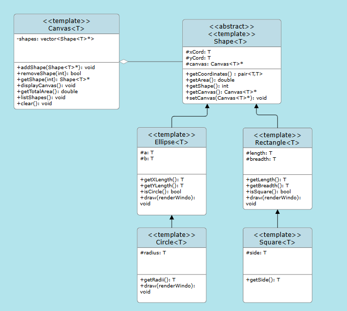

# UML Diagram 



# Instructions to Run the Files

## To Test the Graphics

1. **Ensure SFML is installed** on your system.

2. **Compile the graphics test files** using the following commands (with C++20 standard):

    ```sh
    clang++ -std=c++20 shapes.cpp testGraphics.cpp -o test -lsfml-graphics -lsfml-window -lsfml-system
    g++ -std=c++20 shapes.cpp testGraphics.cpp -o test -lsfml-graphics -lsfml-window -lsfml-system
    ```

3. **Compile the unit tests** for the shape classes:

    ```sh
    clang++ -std=c++20 shapes.cpp testShapes.cpp -o testShapes
    g++ -std=c++20 shapes.cpp testShapes.cpp -o testShapes
    ```

4. **Run the compiled executables:**

    ```sh
    ./test
    ./testShapes
    ```

## Files

- **shapes.cpp**: Implementation of various shape classes.
- **testGraphics.cpp**: Main function to test and display the shapes using SFML.
- **testShapes.cpp**: Unit tests for the shape classes (without graphics).
